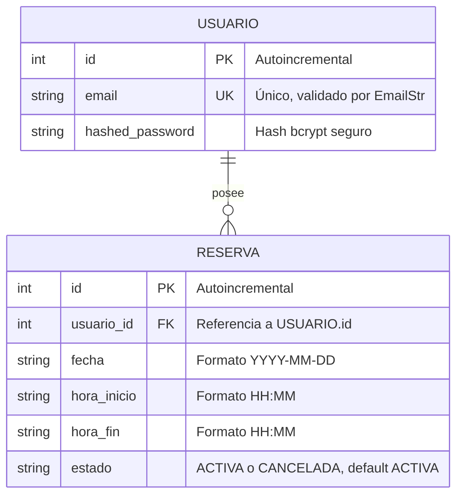
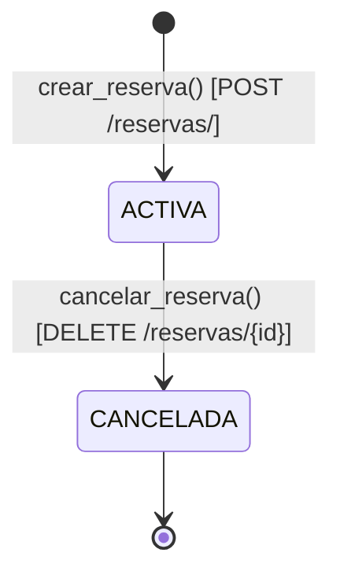

# Phase 1: Data Model

**Feature**: `001-reserva-espacio-compartido`  
**Date**: 2026-09-20  

---

## 1. Diagrama Entidad-Relación



---

## 2. Definición Detallada de Entidades

### Entidad: `Usuario` (Tabla `usuarios`)
Representa la cuenta de un usuario registrado en el sistema.

| Campo | Tipo SQL | Python/ORM | Nulo | Restricciones / Descripción |
|---|---|---|---|---|
| `id` | `INTEGER` | `int` | No | Clave primaria autoincremental (`PRIMARY KEY`). |
| `email` | `VARCHAR(255)` | `str` | No | Identificador único (`UNIQUE`, `INDEX`). Validado con formato RFC 5322. |
| `hashed_password` | `VARCHAR(255)` | `str` | No | Hash seguro generado con `passlib[bcrypt]`. Nunca expuesto en API/MCP. |

---

### Entidad: `Reserva` (Tabla `reservas`)
Representa la asignación temporal del espacio compartido para un usuario.

| Campo | Tipo SQL | Python/ORM | Nulo | Restricciones / Descripción |
|---|---|---|---|---|
| `id` | `INTEGER` | `int` | No | Clave primaria autoincremental (`PRIMARY KEY`). |
| `usuario_id` | `INTEGER` | `int` | No | Clave foránea (`FOREIGN KEY`) hacia `usuarios.id` con eliminación en cascada (`ON DELETE CASCADE`). Indexado. |
| `fecha` | `VARCHAR(10)` | `str` | No | Fecha de la reserva en formato ISO `YYYY-MM-DD`. Indexado junto con `estado`. |
| `hora_inicio` | `VARCHAR(5)` | `str` | No | Hora de inicio en formato 24 horas `HH:MM` (ej. `"09:00"`). |
| `hora_fin` | `VARCHAR(5)` | `str` | No | Hora de fin en formato 24 horas `HH:MM` (ej. `"11:30"`). Debe ser `hora_fin > hora_inicio`. |
| `estado` | `VARCHAR(20)` | `str` | No | Estado de la reserva: `"ACTIVA"` o `"CANCELADA"`. Valor por defecto: `"ACTIVA"`. Indexado. |

---

## 3. Máquina de Estados de la Reserva



- **Transición válida**: Una reserva solo puede crearse en estado `ACTIVA` y transicionar a `CANCELADA`.
- **Efecto de la cancelación**: Al transicionar a `CANCELADA`, el horario queda disponible inmediatamente para nuevas reservas en ese día/horario.
- **Inmutabilidad de canceladas**: Una reserva en estado `CANCELADA` no puede volver a reactivarse.

---

## 4. Índices y Rendimiento

1. **`ix_reservas_usuario_id`**: Optimiza las consultas de listado filtradas por propietario (`SELECT * FROM reservas WHERE usuario_id = :uid LIMIT :l OFFSET :s`).
2. **`ix_reservas_fecha_estado`**: Índice compuesto sobre `(fecha, estado)`. Acelera dramáticamente la consulta de detección de solapamientos:
   ```sql
   SELECT id FROM reservas 
   WHERE fecha = :fecha 
     AND estado = 'ACTIVA' 
     AND hora_inicio < :nueva_fin 
     AND hora_fin > :nueva_inicio;
   ```

---

## 5. Mapeo entre Modelos ORM y Schemas Pydantic

Para cumplir el Artículo V.3 de la Constitución (*"Los schemas de entrada y salida son distintos — nunca se expone el modelo de SQLAlchemy directamente"*):

| Capa | Nombre | Propósito | Campos |
|---|---|---|---|
| **SQLAlchemy** | `Usuario` | Persistencia en base de datos | `id`, `email`, `hashed_password` |
| **Pydantic In** | `UsuarioCreate` | Entrada de registro HTTP | `email: EmailStr`, `password: str` |
| **Pydantic Out** | `UsuarioOut` | Respuesta de creación | `id: int`, `email: EmailStr` |
| **Pydantic Out** | `Token` | Respuesta OAuth2 token | `access_token: str`, `token_type: str = "bearer"` |
| **SQLAlchemy** | `Reserva` | Persistencia en base de datos | `id`, `usuario_id`, `fecha`, `hora_inicio`, `hora_fin`, `estado` |
| **Pydantic In** | `ReservaCreate` | Entrada de creación de reserva | `fecha: str`, `hora_inicio: str`, `hora_fin: str` |
| **Pydantic Out** | `ReservaOut` | Salida de lectura y creación | `id: int`, `usuario_id: int`, `fecha: str`, `hora_inicio: str`, `hora_fin: str`, `estado: str` |
