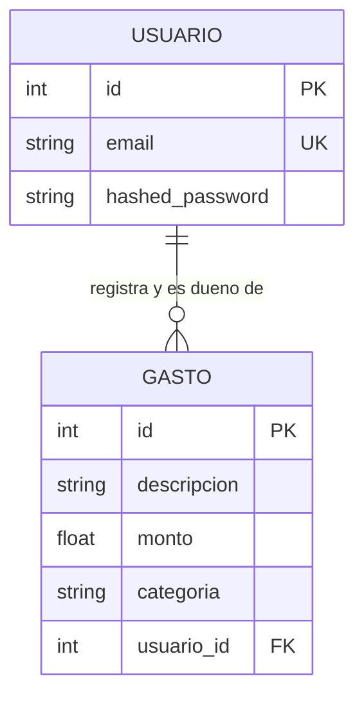

# Data Model: Control de Gastos Personales

**Feature**: `001-control-de-gastos`  
**Date**: 2026-09-16  

## Entidades Principales

### 1. Entidad `Usuario` (Tabla: `usuarios`)

Representa una cuenta de usuario en el sistema.

| Campo | Tipo SQL | Tipo Python / Pydantic | Restricciones | Descripción |
|---|---|---|---|---|
| `id` | `Integer` | `int` | Primary Key, Autoincrement | Identificador único del usuario |
| `email` | `String` | `EmailStr` | Unique, Index, Not Null | Correo electrónico institucional o personal |
| `hashed_password` | `String` | `str` | Not Null | Hash seguro de contraseña mediante bcrypt |

#### Reglas de Validación y Seguridad
- El email debe cumplir formato válido RFC 5322 (`email-validator`).
- La contraseña en texto plano nunca se persiste ni se expone en schemas de respuesta (`UsuarioResponse`).
- La cuenta no maneja atributos de roles ni privilegios administrativos; todos los usuarios poseen el mismo nivel de acceso plano.

---

### 2. Entidad `Gasto` (Tabla: `gastos`)

Representa una transacción financiera o desembolso registrado por un usuario.

| Campo | Tipo SQL | Tipo Python / Pydantic | Restricciones | Descripción |
|---|---|---|---|---|
| `id` | `Integer` | `int` | Primary Key, Autoincrement | Identificador único del gasto |
| `descripcion` | `String` | `str` | Not Null, Stripped len > 0 | Descripción del bien o servicio adquirido |
| `monto` | `Float` | `float` | Not Null, > 0.0 | Valor monetario del gasto |
| `categoria` | `String` | `str` | Not Null, Enum permitido | Categoría temática del gasto |
| `usuario_id` | `Integer` | `int` | Foreign Key (`usuarios.id`), Not Null, Index | Propietario del gasto |

#### Reglas de Validación de Negocio
- **Monto**: Debe ser un número estrictamente positivo ($monto > 0$). Montos $\le 0$ deben ser rechazados.
- **Descripción**: No puede ser una cadena vacía ni contener exclusivamente espacios en blanco.
- **Categoría**: Debe pertenecer al conjunto cerrado: `{"comida", "transporte", "entretenimiento", "otros"}`. Cualquier otra genera `CategoriaInvalidaError`.
- **Presupuesto Máximo**: La suma acumulada de gastos de un usuario para una categoría específica más el nuevo monto no puede exceder `500.0` ($\sum monto \le 500.0$). De lo contrario, se rechaza con `LimiteExcedidoError`.
- **Aislamiento**: Todo listado o cálculo acumulado incluye obligatoriamente el filtro `usuario_id == usuario_actual.id`.

---

## Relaciones y Diagrama Entidad-Relación

